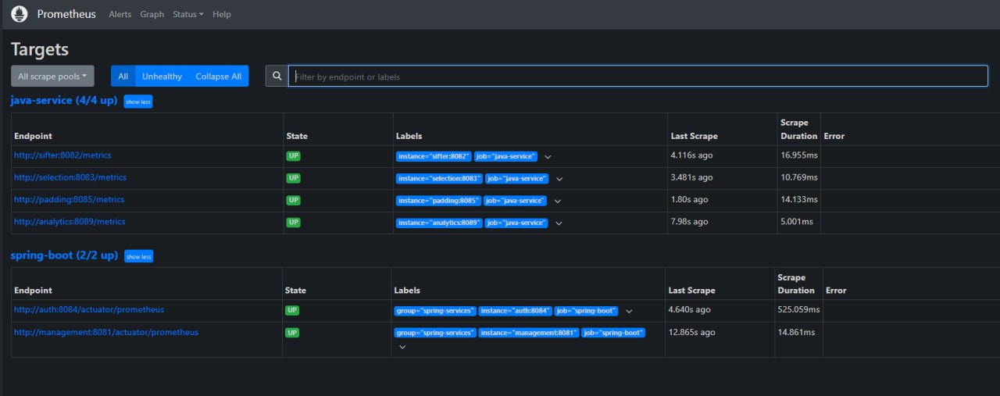
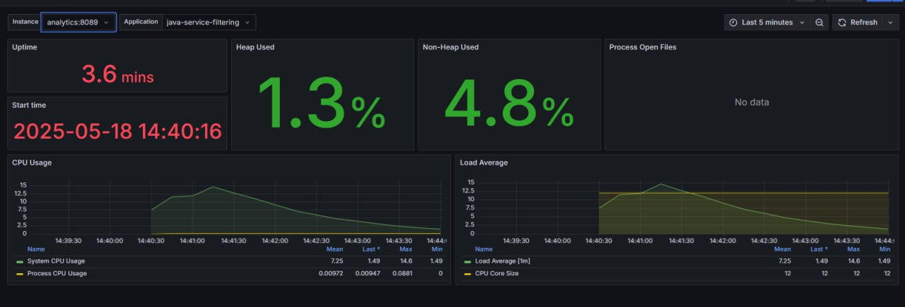
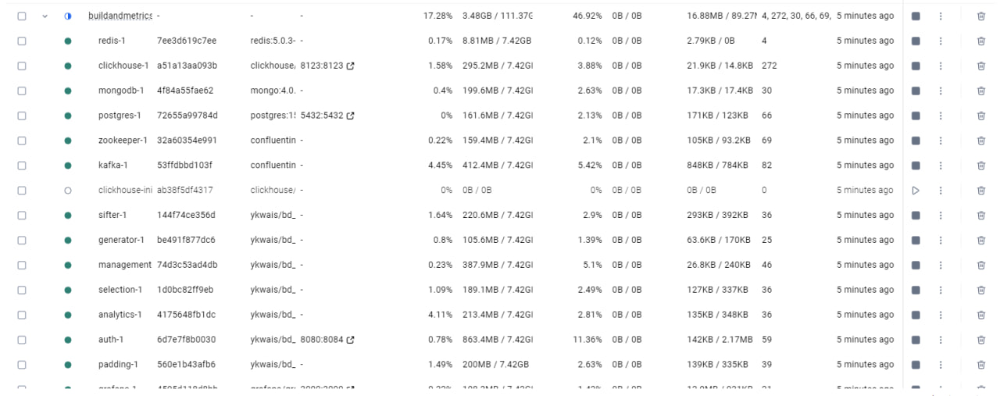
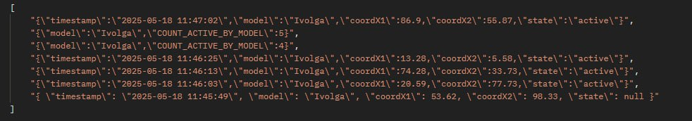

# 🚆 Train Movement Analytics Platform

**Train Movement Analytics Platform** — это распределённая микросервисная система для анализа движения поездов в реальном времени. Проект реализован на основе Spring Boot, Kafka, ClickHouse, Redis, MongoDB и PostgreSQL с полной контейнеризацией в Docker.

---

## 🧩 Архитектура

Проект использует **микросервисный подход**, где каждый модуль выполняет свою задачу и взаимодействует с другими через **Apache Kafka**.

Каждый модуль изолирован в собственном Docker-контейнере, поддерживается полная масштабируемость и отказоустойчивость системы.

---

## ⚙️ Основные технологии

| Технология     | Назначение                                            |
|----------------|-------------------------------------------------------|
| **Spring Boot**| Реализация серверной логики и REST API                |
| **Kafka**      | Асинхронный обмен сообщениями между сервисами         |
| **PostgreSQL** | Хранение бизнес-правил                                |
| **Redis**      | Быстрое кэширование и промежуточные состояния         |
| **MongoDB**    | Гибкое хранение необработанных данных сообщений       |
| **ClickHouse** | Аналитическая обработка и хранение временных рядов    |
| **Docker**     | Контейнеризация всех компонентов                      |
| **Swagger**    | Документация API                                      |
| **Grafana + Prometheus** | Мониторинг и визуализация метрик            |

---

## 🛰️ Модули

- **Kafka** — приём и маршрутизация сообщений.
- **GeneratorMessages** - генерирует входной поток сообщений
- **Filtering** - отбирает подходящие сообщения
- **Deduplication** - убирает повторяющиеся сообщения
- **Enrichment** - добавляет в сообщение необходимую информацию с помощью MongoDb
- **AnalyticsCollector** - помещает данные в ClickHouse для дальнейшего анализа
- **Management** - контролирует правила в psql
- **Authorization** - выполняет jwt-аутентификацию пользователя и общается с Management через FeignClient
- **Jarniki** - рабочая лошадка для сборки и тестирования всего проекта
- **BuildAndMetrics** - готовая директория для запуска и проверки работы проекта - достаточно выполнить docker-compose up —build


---

## 📊 Пример сообщения

```json
{
  "timestamp": "2025-05-17T21:39:13",
  "model": "Ivolga",
  "coordX1": 69.19,
  "coordX2": 60.87,
  "state": null
}
```
  
## Пример Prometheus



## Пример Grafana



## Пример Docker



## Результат




